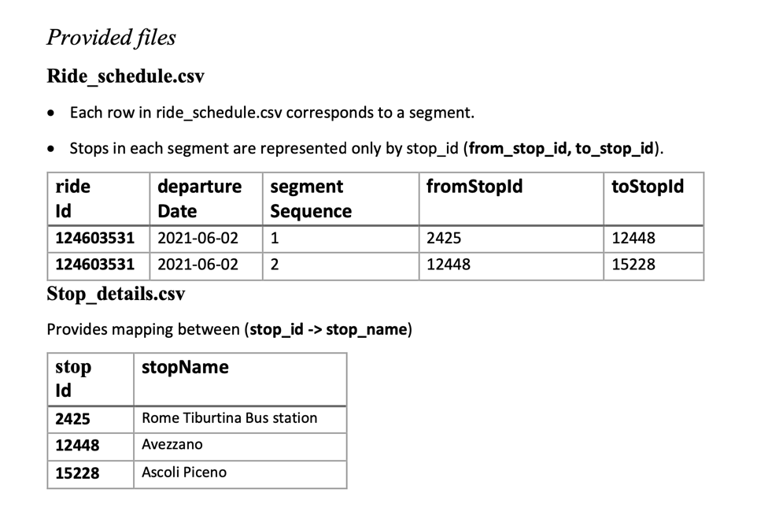
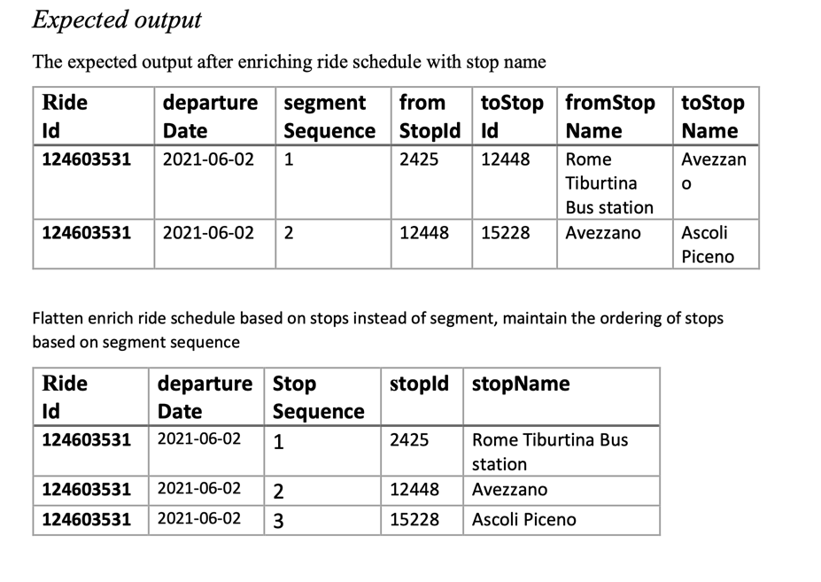

# Ride Schedules Project


# Introduction
This small project is parses csv file which has ride schedules segment details and enrich it
with stop names and flatten it by stop wise instead of segment
The API is using in memory storage to store and retrieve information

# Project Documentation
1. Process all rows of ride_schedule.csv and enrich them with the stop name using “stop_details.csv” as a look-up. Write the output to another csv file called stop_details_enriched.csv

2. The output file of the 1st task is represented by segment-wise rows, with from/to stop_id. The next task is to flatten those schedules based on stop instead of segment. The output of this task should only have one stop per row. The ordering of stops should be consistent with the segment sequence, and it is represented by a new property called “StopSequence”. The result should be a csv with “flattened”

3. Output the result to csv file





# Steps to run the application from Console using Docker
1. Make sure you have maven, Docker and JDK 16 installed in your local system
2. Run command to build an image
   ```` 
   mvn clean compile assembly:single 
   mvn docker:build   
   ````
3. Now run command to run dockerized image
```
docker run schedules/rideschedules

```


4. Application will be started and will put logs on the console

5. You can also see output files at below locations
 ``src/main/resources/stop_details_enriched.csv``
   ``src/main/resources/stop_details_enriched_flattened.csv``


# Steps to run the application from IDEA
1. Just simply run main class ``RideSchedulesApplication.java``

# Steps to run unit tests
1. Just simply run command ``mvn test``